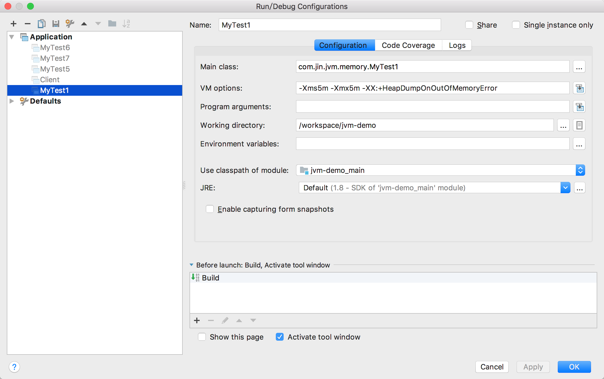
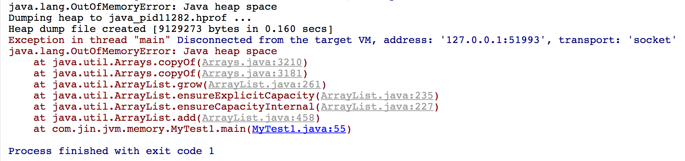
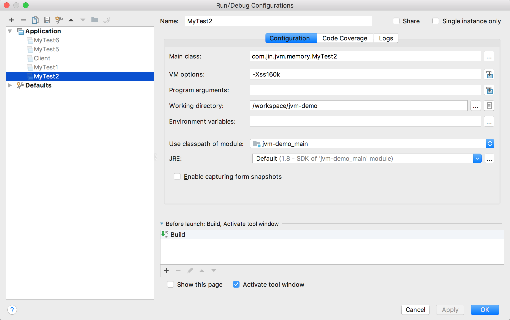

## JVM参数

> JVM参数都是以【-XX:】开头的 后面跟一个+或者-，+表示开启，-表示关闭，

> 为什么会有+或者-呢？因为有些JVM参数默认是开启的有些默认是关闭的

> 在VM的参数设置中一共只有三种设置方式：

> -XX:+\<option>, 表示开启option选项, boolean值类型参数

> -XX:-\<option>, 表示关闭option选项

> -XX:\<option>=\<value>, 表示将option选项的值设置成value. 典型的如调整堆空间大小

|参数|说明|示例|
|---|---|---|
|-Xms|设置最小堆内存|-Xms5m  设置最小堆内存5兆|
|-Xmx|设置最大堆内存|-Xmx10m  设置最大堆内存10兆|
|-XX:+HeapDumpOnOutOfMemoryError|设置当发生OOM的时候保存当前线程的堆栈信息到文件中|-XX:+HeapDumpOnOutOfMemoryError|
|-Xss160k|设置虚拟机栈内存大小|-Xss160k 设置虚拟机栈大小(stack size)为160k|
|-XX:+TrackClassLoading|按类的加载顺序输出程序所加载的类，用于追踪类的加载信息并打印出来.||
|-XX:+TraceClassUnloading|输出类的卸载信息.||
|-XX:MaxMetaspaceSize=10m|设置元空间(方法区)最大值||
||||

### -XX:+TrackClassLoading
> 按类的加载顺序输出程序所加载的类，用于追踪类的加载信息并打印出来.

### -XX:+TraceClassUnloading
> 输出类的卸载信息.

### OOM示例

|参数|说明|示例|
|---|---|---|
|-Xms|设置最小堆内存|-Xms5m  设置最小堆内存5兆|
|-Xmx|设置最大堆内存|-Xmx10m  设置最大堆内存10兆|
|-XX:+HeapDumpOnOutOfMemoryError|设置当发生OOM的时候保存当前线程的堆栈信息到文件中|-XX:+HeapDumpOnOutOfMemoryError|

### StackOverflowError示例

|参数|说明|示例|
|---|---|---|
|-Xss160k|设置虚拟机栈内存大小|-Xss160k 设置虚拟机栈大小(stack size)为160k|

### 方法区产生内存溢出错误 OutOfMemoryError: Metaspace

|参数|说明|示例|
|---|---|---|
|-XX:MaxMetaspaceSize=10m|设置元空间(方法区)最大值||

