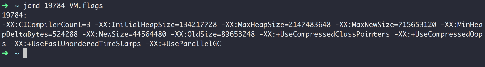
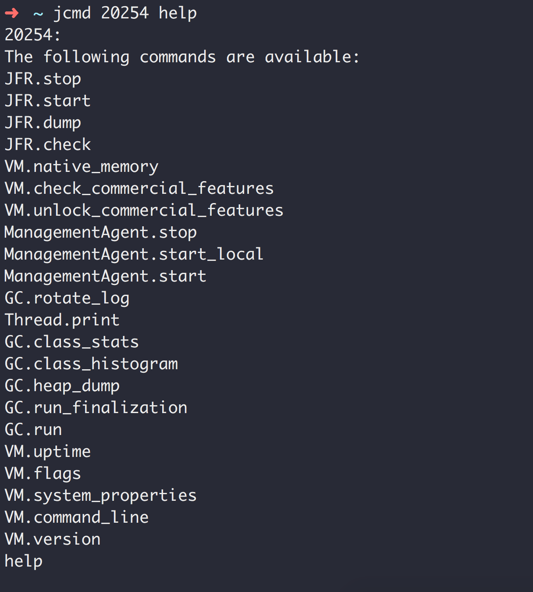
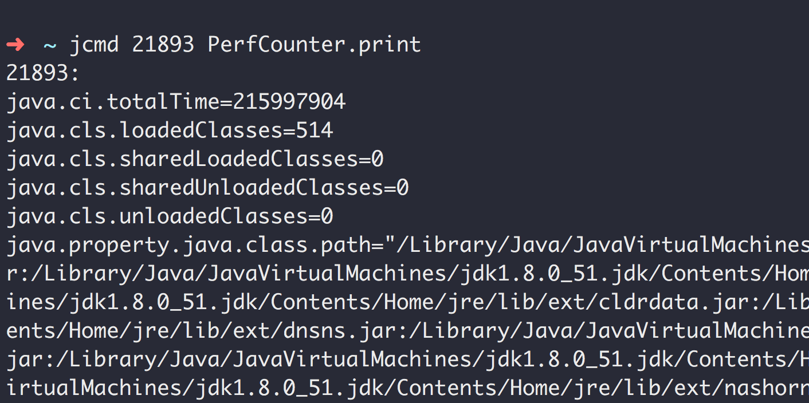
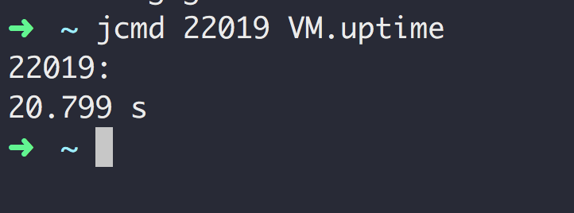
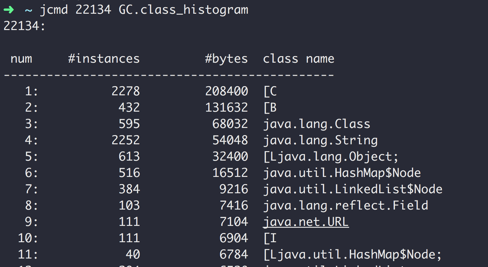
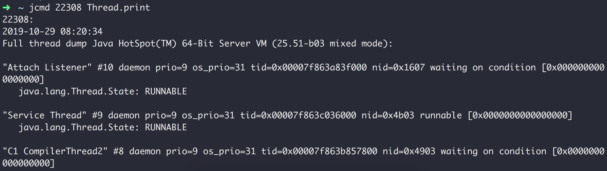
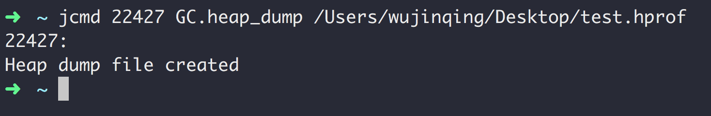
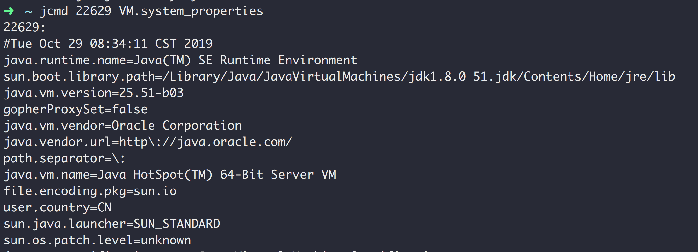
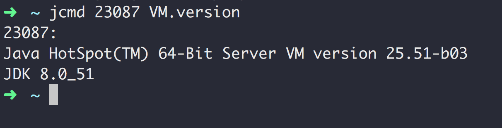
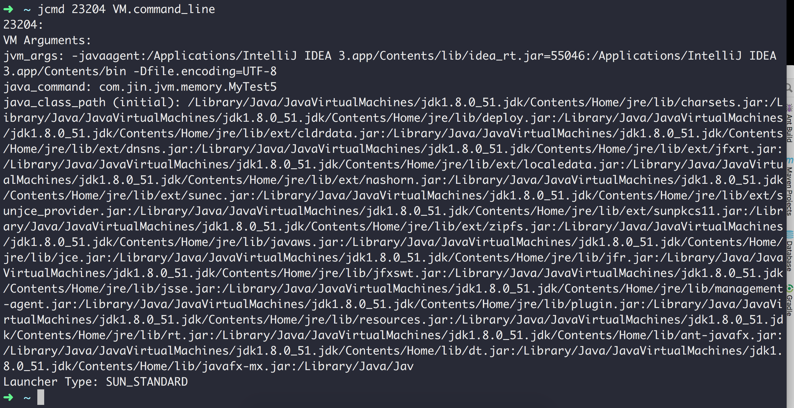

## jcmd

> 格式: jcmd pid 参数

### 参数
|参数|说明|示例|
|---|---|---|
|VM.flags|查看JVM的启动参数|jcmd pid VM.flags|
|help|列出当前运行的Java进程可以执行的操作|jcmd pid help|
|help 命令|查看具体命令的选项|jcmd pid help VM.flags|
|PerfCounter.print|查看JVM性能相关的参数|jcmd 21893 PerfCounter.print|
|VM.uptime|查看JVM的启动时长(启动后运行多久了)|jcmd 22019 VM.uptime|
|GC.class_histogram|查看系统中类的统计信息|jcmd 22134 GC.class_histogram|
|Thread.print|查看线程的堆栈信息|jcmd 22308 Thread.print|
|GC.heap_dump|导出Heap dump文件，导出的文件可以通过jvisual vm查看|jcmd 22427 GC.heap_dump /Users/wujinqing/Desktop/test.hprof|
|VM.system_properties|查看JVM的属性信息|jcmd 22629 VM.system_properties|
|VM.version|查看JDK和虚拟机的版本信息|jcmd 23087 VM.version|
|VM.command_line|查看JVM启动的命令行参数信息|jcmd 23204 VM.command_line|

### jcmd 19784 VM.flags

### jcmd 20254 help

### jcmd 21893 PerfCounter.print

### jcmd 22019 VM.uptime

### jcmd 22134 GC.class_histogram

### jcmd 22308 Thread.print

### jcmd 22427 GC.heap_dump /Users/wujinqing/Desktop/test.hprof

### jcmd 22629 VM.system_properties

### jcmd 23087 VM.version

### jcmd 23204 VM.command_line

