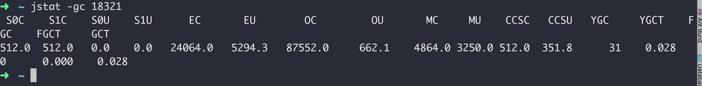
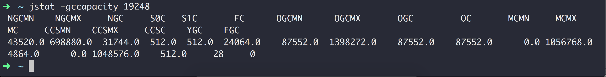
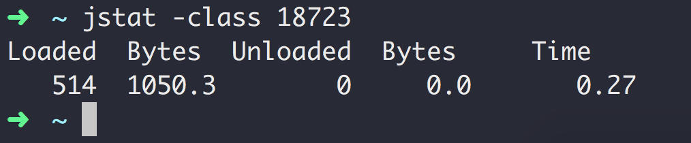

## jstat

### 示例

### jstat -gc 18321 垃圾回收统计

|参数|说明|示例|
|---|---|---|
|S0C|Survivor 0 Capacity|年轻代中第一个survivor（幸存区）的容量 (字节)|
|S1C|Survivor 1 Capacity|年轻代中第二个survivor（幸存区）的容量 (字节)|
|S0U|Survivor 0 Utilization|年轻代中第一个survivor（幸存区）目前已使用空间 (字节)|
|S1U|Survivor 1 Utilization|年轻代中第二个survivor（幸存区）目前已使用空间 (字节)|
|EC|Eden Capacity|年轻代中Eden区的容量 (字节)|
|EU|Eden Utilization|年轻代中Eden区目前已使用空间 (字节)|
|OC|Old Capacity|Old代的容量 (字节)|
|OU|Old Utilization|Old代目前已使用空间 (字节)|
|MC|Current Metaspace Capacity|当前元空间的容量|
|MU|Metaspace Utilization|已使用元空间大小|
|CCSC|||
|CCSU|||
|YGC|||
|YGCT|||
|FGC|||
|FGCT|||
|GCT||从应用程序启动到采样时gc用的总时间(s)|

### jstat -gccapacity 19248 堆内存统计

|参数|说明|示例|
|---|---|---|
|NGCMN|||
|NGCMX|||
|NGC|||
|S0C|Survivor 0 Capacity||
|S1C|Survivor 1 Capacity||
|EC|Eden Capacity||
|OGCMN|||
|OGCMX|||
|OGC|||
|OC|Old Capacity||
|MCMN|||
|MCMX|||
|MC|Metaspace Capacity||
|CCSMN|||
|CCSMX|||
|CCSC|||
|YGC|||
|FGC|||

### jstat -class 18723 查看加载类的情况

|参数|说明|示例|
|---|---|---|
|Loaded|已加载的类数量||
|Bytes|已加载的类所占空间大小||
|Unloaded|卸载的类数量||
|Bytes|卸载的类所占空间大小||
|Time|时间||

