## JVM笔记

### 类加载
> 在Java代码中，类型的加载、连接与初始化过程都是在程序运行期间完成的。

> 类型是什么？我们定义的class, interface, enum，java.lang.String等等，并不涉及对象

> 类型的加载最常见的是将编译好的class文件从磁盘上加载到内存当中

> 连接将类与类之间的关系确定好，

> 初始化：对类型里面的一些静态的变量进行赋值

### 类加载器
类加载器是用来加载类型的

Java虚拟机本身就是一个进程，在下面几种情况下就结束生命周期

> 执行了System.exit()方法

> 程序正常执行结束

> 程序在执行过程中遇到了异常或者错误而异常终止（异常一直往外抛，最终达到main方法，main方法再往上抛紧接着程序就退出了）

> 由于操作系统错误而导致Java虚拟机进程终止，这是我们无法控制的

### 类的加载、连接与初始化

**加载**

> 加载：查找并加载类的二进制数据，将class文件加载到内存

**连接**

> 连接: 最为复杂的阶段，又分为3个阶段

> 1.验证：确保被加载的类的正确性

> 2.准备：为类的静态变量分配内存，并将其初始化为默认值，比如整型的默认值是0，boolean类型的默认值是false，引用的默认值是null

> 如：public static int a = 1, 在准备阶段并不会将1赋给a，而是将0赋给a

> 3.解析：把类中的符号引用转换为直接引用，符号引用：方法里面引用了某个类，直接引用：内存地址

**初始化**
> 初始化：为类的静态变量赋予正确的初始值

> 如：将1赋给了a，执行静态代码块

**类的使用与卸载**

> 使用: 比如：创建类的对象，调用类的方法，使用是和我们开发打交道最多的一个过程

> java程序对类(不是对象)的使用方式分为两种

> 1.主动使用

> 2.被动使用

> 所有的Java虚拟机实现必须在每个类或接口被Java程序“**首次主动使用**”时才被初始化他们

首次主动使用说明：

> 被动使用不会初始化他们

> 只会初始化一次

### 主动使用（七种）

> 1.创建类的实例。-> new 出来一个对象

> 2.访问某个类或接口的静态变量，或者对该静态变量赋值。-> 对静态变量赋值(putstatic)和取值(getstatic)

> 3.调用类的静态方法. -> 和第二种情况一样(invokestatic)

> 4.反射(如Class.forName("com.jin.Test"))

> 5.初始化一个类的子类。它的父类也会被初始化

> 6.Java虚拟机启动时被标记为启动类(Java Test)。 包含main方法的那个类

> 7.JDK1.7 开始提供动态语言支持：

> java.lang.invoke.MethodHandle实例的解析结果REF_getStatic, REF_putStatic,REF_invokeStatic句柄对应的类没有初始化，则初始化。 了解一下就行

除了以上七种情况，其他使用Java类的方式都被看作是对类的**被动使用**，都不会导致类的**初始化**。

> 不会初始化并不意味着不会去加载，初始化是第三个阶段

> Parent2 parent2;// 仅仅声明一个类的引用并不是对这个类的主动使用

> 如果我用子类去访问父类的无论是静态变量也好、静态方法也好，本质上都表示对父类的主动使用，而并不是对子类的主动使用，变量定义在谁身上就表示对谁的主动使用，并不看调用方

### 类的加载

> 类的加载指的是将类的.class文件中的二进制数据读入到内存中，将其放在运行时数据区的方法区内，
> 然后在内存中创建一个java.lang.Class对象(规范并未说明Class对象位于哪里，HotSpot虚拟机将其放在了方法区中)
> 用来封装类在方法区内的数据结构

说明：
> 一个类无论创建了多少个对象，所有对象所对应的Class对象只有一个。

### 加载.class文件的方式

> 从本地系统中直接加载。绝大多数情况下使用的方式

> 通过网络下载.class文件。

> 从zip, jar等归档文件中加载.class文件。

> 从专有数据库中提取.class文件。

> 将Java源文件动态编译为.class文件。动态代理会使用，jsp转换成的servlet类

### 静态字段

> 对于静态字段来说，只有直接定义了该字段的类才会被初始化；

> 当一个类在初始化时，要求其父类全部都已经初始化完毕了(父类还有父类 都要先初始化)

### 常量

> 常量在编译阶段会存入到调用这个常量的方法所在的类的常量池当中,本质上，调用类并没有直接引用到定义常量的类，因此并不会触发定义常量的类的初始化。

> 另外：当一个常量的值并非编译期间可以确定的，那么其值就不会被放到调用类的常量池中，这时在程序运行时，会导致主动使用这个常量所在的类，显然会导致这个类被初始化。
>

### 静态代码块

> 静态代码块只会被执行一次， 首次主动使用才会被初始化， 静态代码块是在初始化的时候执行的, 当实例化一个类的多个对象时静态代码块只会执行一次。

### 数组类型

> 对于数组实例来说，其类型是由JVM在运行期动态生成的，表示为[Lcom.jin.jvm.classloader.MyParent4

> 这种形式。动态生成的类型，其父类型就是Object。

> 对于数组来说，Javadoc经常将构成数组的元素称为Component，实际上就是将数组降低一个维度后的类型。

> 如一维数组MyParent4\[]， 它的Component就是MyParent4。

> 二维数组MyParent4\[]\[]，它的Component就是[Lcom.jin.jvm.classloader.MyParent4

### 接口

> 当一个接口在初始化时， 并不要求其父接口都完成了初始化（和类的初始化是不一样的）.

> 只有在真正使用到父接口的时候(如引用接口中所定义的常量时)，才会初始化。

> 接口中的属性都是public、static, final的， 修饰符可以省略.

> 接口本身是没有静态代码块的。

> 初始化是按代码顺序从上到下执行的

### 类的加载过程

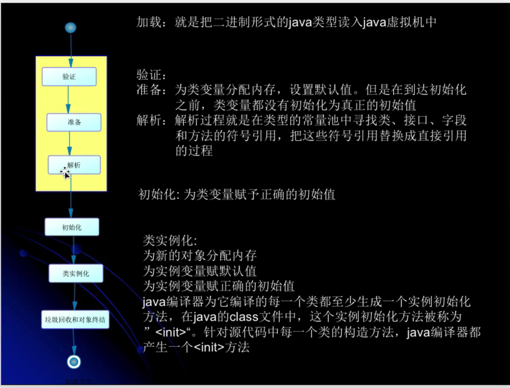

### 类的加载

> 还没涉及到类的生成。

> Class对象是整个反射的入口，它就好像是一面镜子一样能够洞悉出来所有我在类中编写的字段和方法。

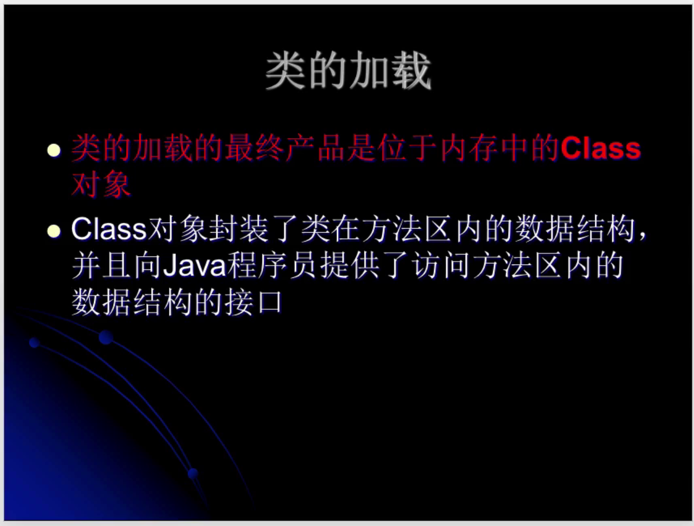

> 类一定是由类的加载器来加载

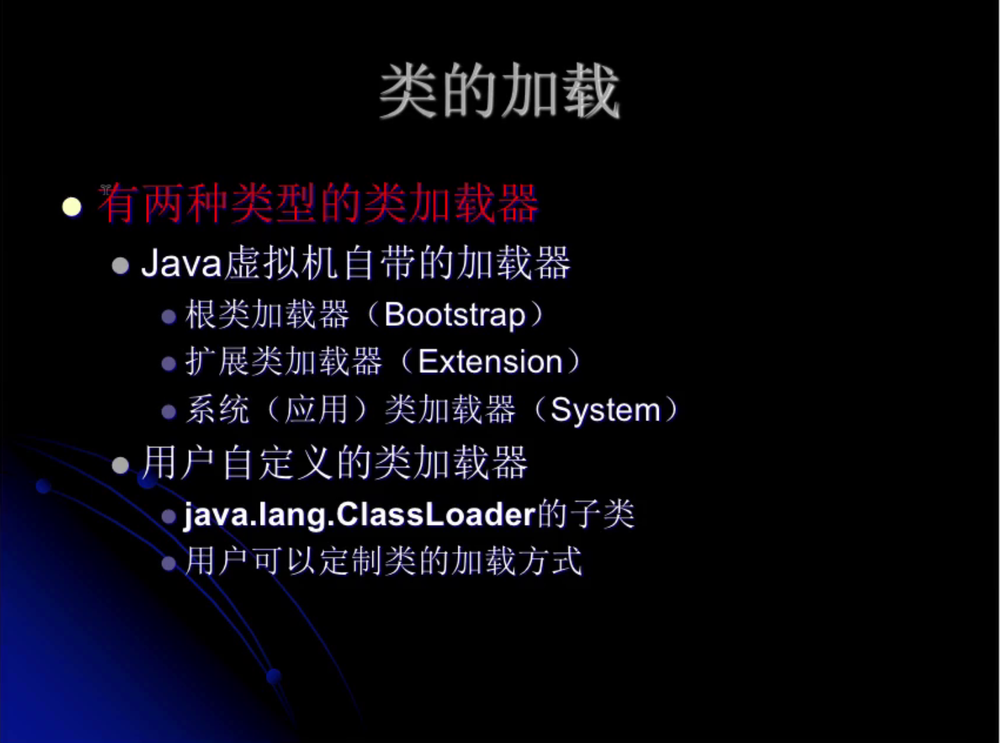

> 类的加载器并不需要等到某个类被 **“首次主动使用”** 时再加载它。

> JVM规范允许类加载器在预料某个类将要被使用时就预先加载它，如果在预先加载的过程中遇到了.class文件缺失或存在错误，

> 类加载器必须在 **程序首次主动使用** 该类时才报告错误(LinkageError错误)。

> 如果一个类一直没有被程序主动使用，那么 **类加载器就不会报告错误**

> 类被加载后，就进入连接阶段。连接就是将已经读入到内存的类的二进制数据合并到虚拟机的运行时环境中去。

### 类的验证

类的验证内容
* 类文件的结构检查
* 语义检查
* 字节码验证
* 二进制兼容性的验证

### 准备阶段

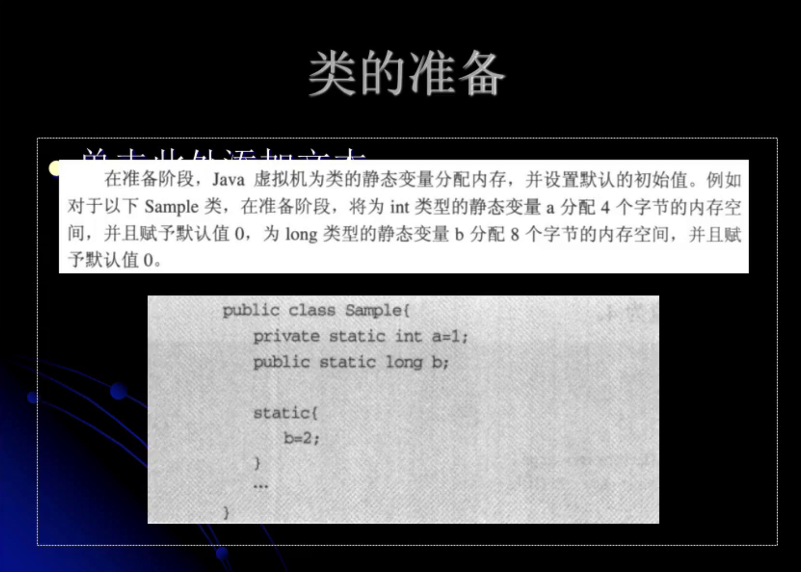

### 类的初始化

静态变量的初始化有两种途径：
* 在静态变量的声明处进行初始化。
* 在静态代码块中进行初始化。

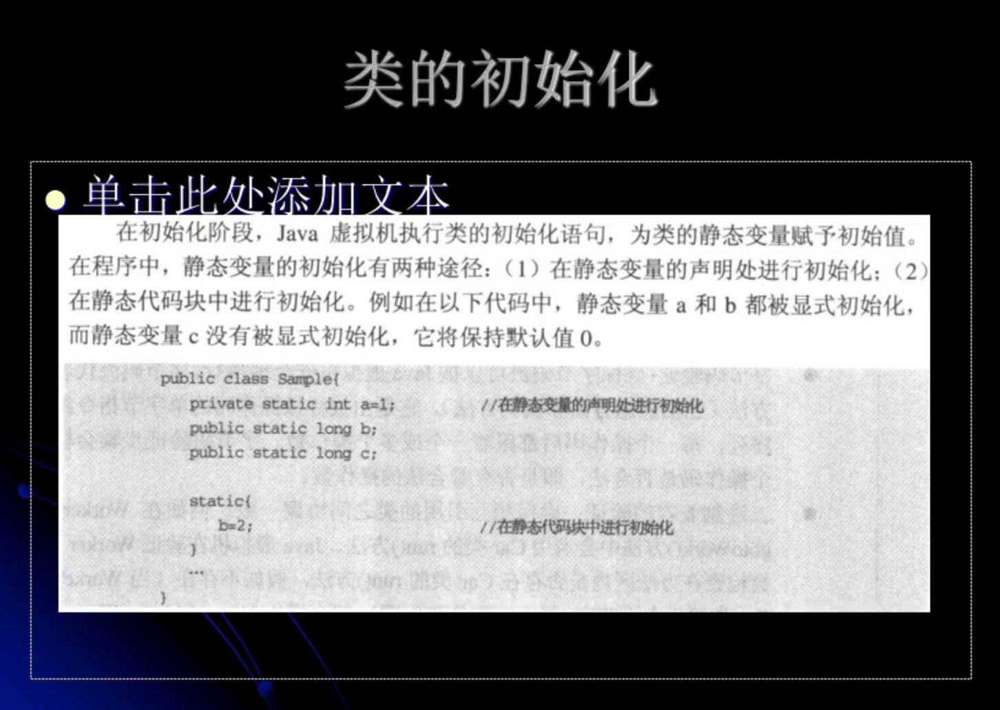
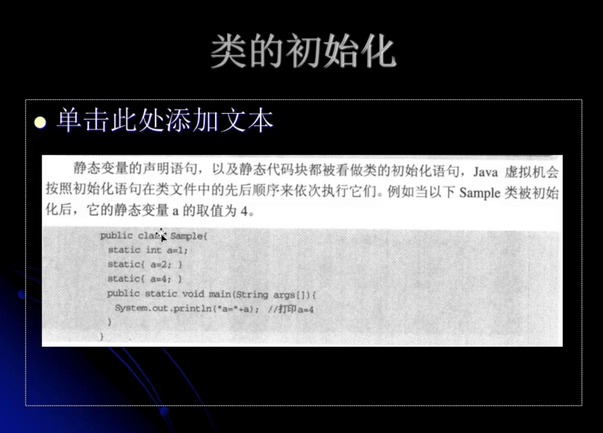

### 类的初始化步骤
* 假如这个类还没有被加载和连接，那就先进行加载和连接。
* 假如类存在直接父类，并且这个父类还没有被初始化，那就先初始化直接父类。
* 假如类中存在初始化语句，那就依次执行这些初始化语句。

### 类的初始化时机

当Java虚拟机初始化一个类的时候，要求它的所有父类都已经被初始化，但是这条规则并不适用于接口。

* 在初始化一个类时，并不会先初始化它所实现的接口。
* 在初始化一个接口时，并不会先初始化它的父接口。

因此，一个父接口并不会因为它的子接口或者实现类的初始化而初始化。只有当程序首次使用特定接口的静态变量时，才会导致该接口的初始化。

> 只有当程序访问的静态变量或静态方法确实在当前类或当前接口中定义时，才可以认为是对类或接口的主动使用。

> 调用ClassLoader类的loadClass方法加载一个类，并不是对类的主动使用，并不会导致类的初始化。

> 当一个类被初始化的时候它所实现的接口是不会被初始化的

### 类加载器

> 类加载器用来把类加载到Java虚拟机中。从JDK1.2版本开始，类的加载过程采用双亲委托机制，这种机制能更好地保证Java平台的安全。
> 在双亲委托机制中，除了Java虚拟机自带的根类加载器(没有父类)以外，其余的类加载器都有且只有一个父加载器。当Java程序请求加载器loader1
> 加载Sample类时，loader1首先委托自己的父加载器去加载Sample类，若父加载器能加载，则由父加载器完成加载任务，否则才由加载器loader1本身加载Sample类。

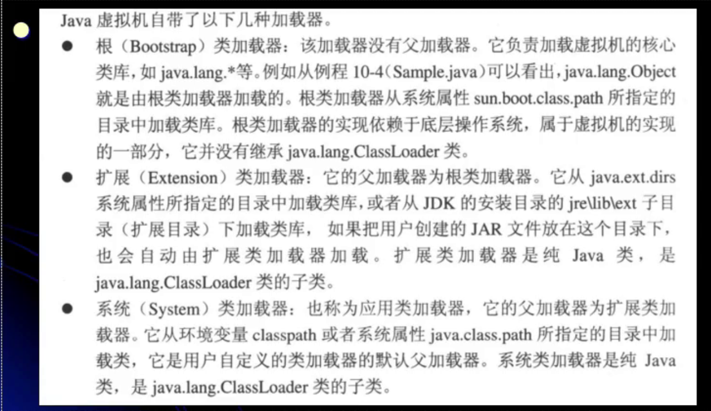

除了以上虚拟机自带的加载器外，用户还可以定制自己的类加载器。Java提供了抽象类java.lang.ClassLoader, 所有用户自定义的类加载器都应该继承ClassLoader类。

### 类加载器之间的关系

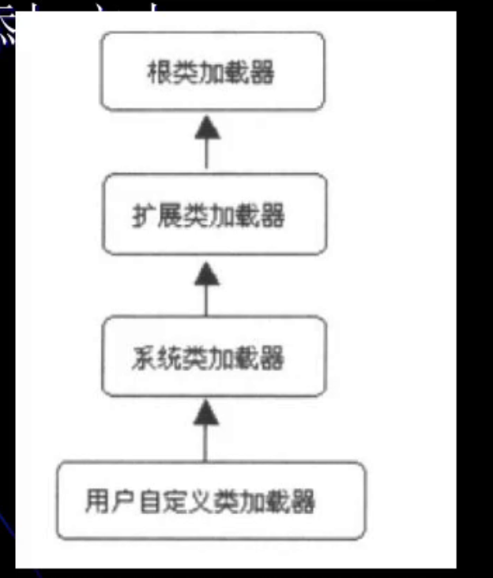

> 从表象上来看他们是一种继承关系，实际上他们是一种包含关系(子加载器包含父加载器的一个引用)

### 静态代码块与非静态代码块

> 静态代码块只会在初始化阶段执行一次

> 非静态代码块在每次实例化对象的时候都会执行一次

### 类加载器的父亲委托机制
> 在父亲委托机制中，各个加载器按照父子关系形成了**树形结构**，除了根类加载器之外，其余的类加载器都有且只有一个父加载器。

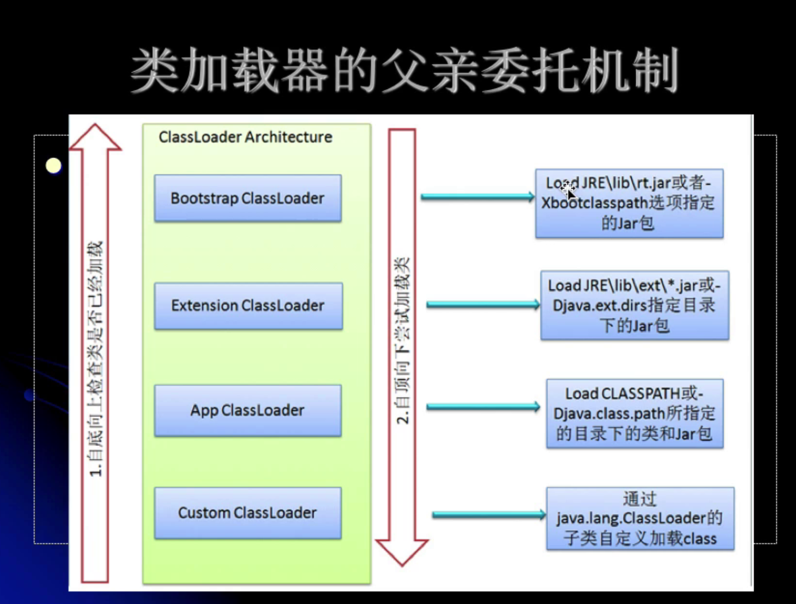
> 自底向上检查类是否已经加载。

> 自顶向下尝试加载类。

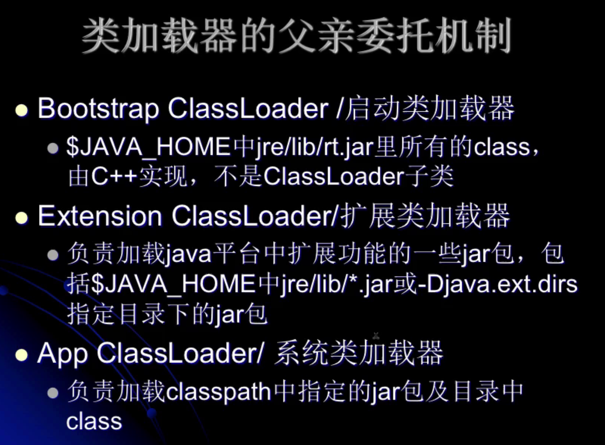

### 调用ClassLoader类的loadClass方法加载一个类，并不是对类的主动使用，不会导致类的初始化

> classLoader.loadClass("com.jin.jvm.classloader.CL");// 不是主动使用

> Class.forName("com.jin.jvm.classloader.CL");// 主动使用

### 类加载器

> sun.misc.Launcher$AppClassLoader@14dad5dc 系统类加载器或者应用类加载器。

> sun.misc.Launcher$ExtClassLoader@4b1210ee 扩展类加载器。

> null 启动类加载器（java doc 里面说明了有些实现将getParent返回为null来代表启动类加载器）。

**类加载器是加载类的，不是对象的，跟对象没有关系**

**每一个类都是由类加载器加载到JVM当中的**

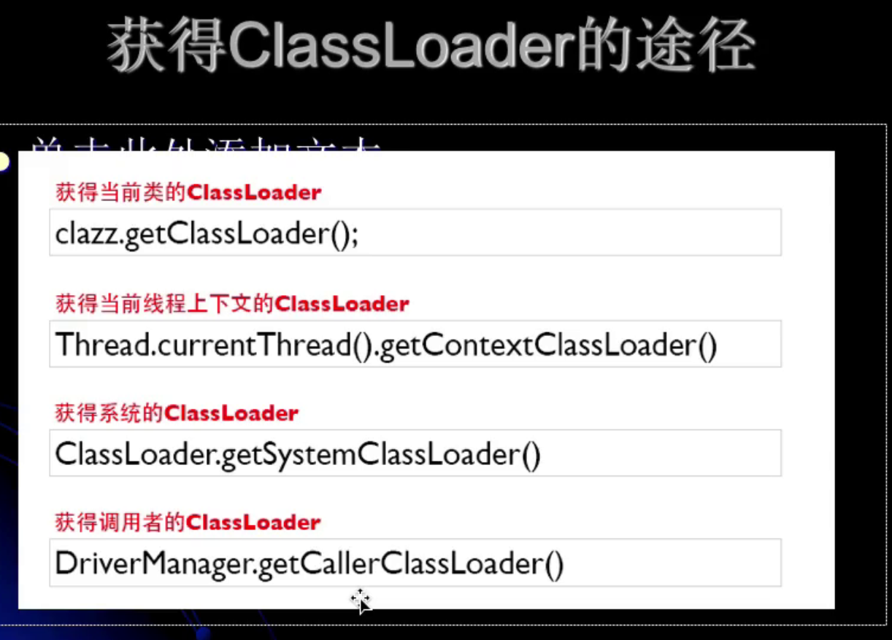

### 类加载器的命名空间
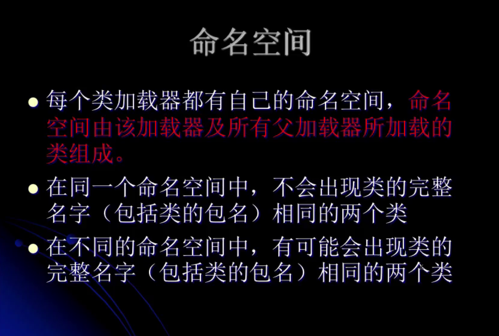

> 同一个类的两个类加载器实例可以成为父子关系(因为类加载器是包含关系)

### 类的卸载
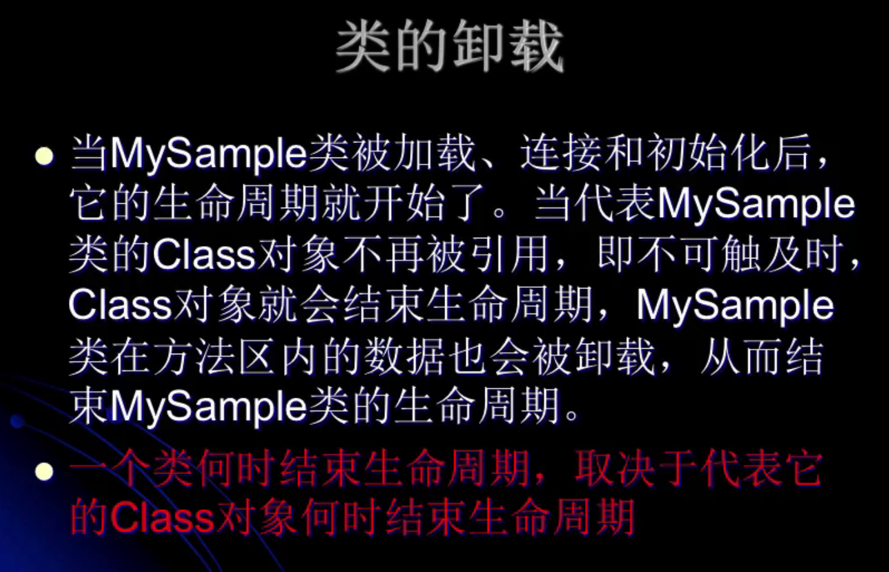
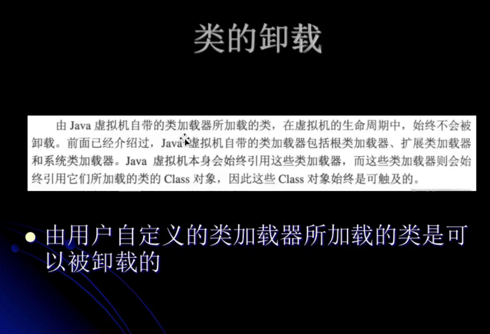
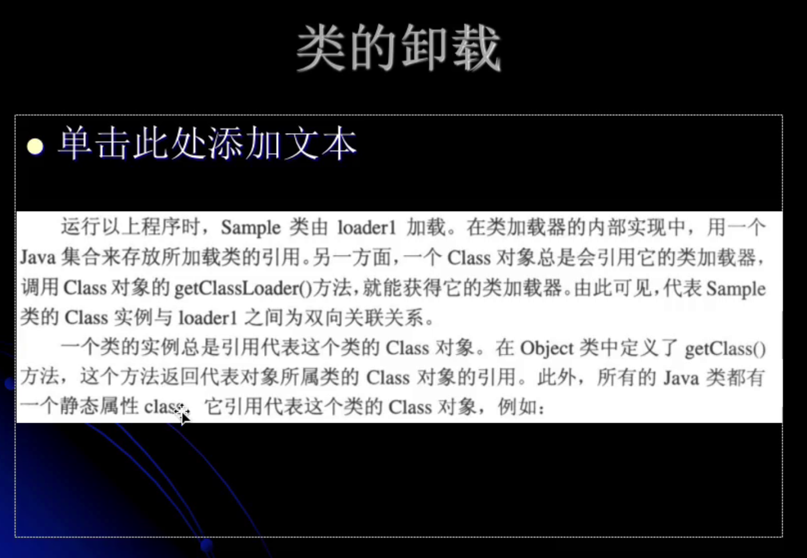

