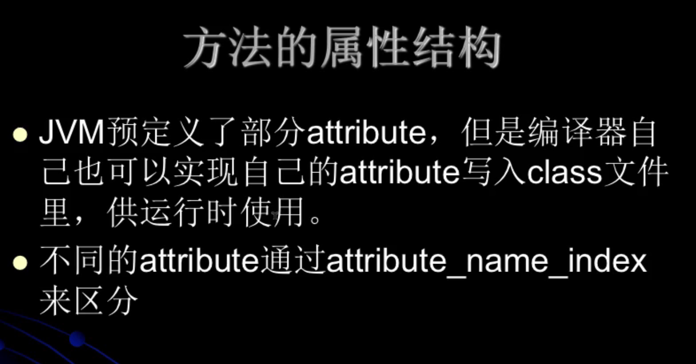

## JVM笔记-字节码


> 1.使用javap -verbose命令分析一个字节码文件时，将会分析该字节码文件的魔数、版本号、常量池、类信息、类的构造方法信息、类变量与成员变量等信息。

> 2.魔数：所有的.class字节码文件的前4个字节都是魔数，魔数值为固定值：0xCAFEBABE。

> 3.魔数之后的4个字节为版本信息，前两个字节表示minor version(次版本号)，后两个字节表示major version(主版本号)。这里的版本号为00 00 00 34，换算成十进制，表示次版本号为0，主版本号为52，所以该文件的版本号为：1.8.0。可以通过java -version命令来验证这一点。

> 4.常量池(constant pool)：紧接着主版本号之后的就是常量入口。一个Java类中定义的很多信息都是由常量池来维护和描述的，可以将常量池看作是Class文件的资源仓库，比如说Java类中定义的方法和变量信息，都是存储在常量池中。常量池中主要存储两类常量: 字面量与符号引用。字面量如文本字符串，Java中声明为final的常量值等，而符号引用如类和接口的全局限定名，字段的名称和描述符，方法的名称和描述符等。

> 5.常量池的总体结构：Java类所对应的常量池主要由常量池数量和常量池数组(常量表)这两部分共同构成。常量池数量紧跟在主版本号后面，占据2个字节；常量池数组则紧跟在常量池数量之后。常量池数组与一般数组不同的是，常量池数组中不同的元素的类型、结构都是不同的，长度当然也就不同；但是，每一种元素的第一个数据都是u1类型，该字节是个标志位，占据1个字节，JVM在解析常量池时，会根据这个u1类型来获取元素的具体类型。
> 值得注意的是，常量池数组中元素的个数 = 常量池数 - 1 (其中0暂时不适用)，目的是满足某些常量池索引值的数据在特定情况下需要表达“不引用任何一个常量池”的含义；根本原因在于，索引为0也是一个常量(保留常量)，只不过它不位于常量表中，这个常量就对应null值；所以，常量池的索引从1开始而非0开始。


### 字节码文件整体结构图


> 6.在JVM规范中，每个变量/字段都有描述信息，描述信息主要的作用是描述字段的数据类型、方法的参数列表(包括数量、类型与顺序)与返回值。根据描述符规则，基本数据类型和代表无返回值的void类型都用
> 一个大写字符来表示，对象类型则使用字符串L加对象的完全限定名称来表示。为了压缩字节码文件的体积，对于基本数据类型，JVM都只用一个大写字母来表示，如下所示：

|大写字母|类型|
|---|---|
|B|byte|
|C|char|
|D|double|
|F|float|
|I|int|
|J|long|
|S|short|
|Z|boolean|
|V|void|
|L|对象类型|

> 如：字符串Ljava/lang/String

> 7.对于数组类型来说，每一个维度使用一个前置的\[来表示，如int\[]被记录为\[I, String\[]\[]被记录为\[\[Ljava/lang/String;

> 8.用描述符描述方法时，按照先参数列表，后返回值的顺序来描述。参数列表按照参数的严格顺序放在一组()之内，如方法: String getRealnameByIdAndNickname(int id, String name)的描述符为: (I, Ljava/lang/String;)Ljava/lang/String;


### 当前类的访问修饰符


ACC_PRIVATE 0X0002

### 字段表


### 方法表





> Code属于attribute

### Code（方法体内容字节码）


### LocalVariableTable结构
```
LocalVariableTable_attribute {
    u2 attribute_name_index;
    u4 attribute_length;
    u2 local_variable_table_length;
    local_variable_info[local_variable_table_length];
}


local_variable_info {
    u2 start_pc;
    u2 length;
    u2 name_index;
    u2 descriptor_index;
    u2 indext; 局部变量索引
}
```

> 源代码将会转换成一条一条的指令(助记符)

[指令集(助记符集)](https://docs.oracle.com/javase/specs/jvms/se8/html/jvms-6.html#jvms-6.5.aload_n)

在字节码中每一个实例方法(含构造方法)的第一个局部变量都是this(隐式传递)

### synchronized方法或代码块
> 会在字节码中插入一个monitorenter指令，及一个或者多个monitorexit指令

> 当synchronized修饰方法时如果是实例方法那么锁的是当前对象this，如果是静态方法那么锁的是当前类的Class对象。


> clinit: 对静态变量进行初始化，在类的初始化阶段执行，只会执行一次。

> init: 对实例变量进行初始化，在构造方法中执行，每次实例化对象都会执行。

> 如果有多个构造方法，实例变量的赋值会放到每一个构造方法中。

> 不管有多少个静态变量，多少个静态代码块只会有一个clinit。

### this关键字

> 对于Java类中的每一个实例方法(非static方法)，其在编译后所生产的字节码当中，方法参数的数量总是比源代码中方法
> 参数的数量多一个(this)，它位于方法的第一个参数位置处；这样，我们就可以在Java的实例方法中使用this来去访问当前
> 对象的属性以及其他方法。

> 这个操作是在编译期间完成的，即由javac编译器在编译的时候将对this的访问转化为对一个普通实例方法参数的访问；接下来在运行期间，
> 由JVM在调用实例方法时，自动向实例方法传入该this参数。所以，在实例方法的局部变量表中，至少会有一个指向当前对象的局部变量。

### 局部变量(由两部分构成)：方法参数 + 方法体里面定义的变量。

### Java字节码对于异常的处理方式：

>  1.统一采用异常表的方式来对异常进行处理。

>  2.在jdk 1.4.2之前的版本中，并不是使用异常表的方式来对异常进行处理的，而是采用特点的指令方式。

>  3.当异常处理存在finally语句块时，现代化的JVM采取的处理方式是将finally语句块的字节码拼接到每一个catch块后面，
>  换句话说，程序中存在多少个catch块，就会在每一个catch块后面重复多少个finally语句块的字节码。


### 栈帧(stack frame)

> 栈帧是一种用于帮助虚拟机执行方法调用与方法执行的数据结构。

> 栈帧本身是一种数据结构，封装了方法的局部变量表、动态链接信息、方法的返回地址以及操作数栈等信息。


> 每个线程都有一个独立的栈帧，栈帧是不会出现并发问题的

> 符号引用，直接引用

> 有些符号引用是在类加载阶段或是第一次使用时就会转换为直接引用，这种转换叫做静态解析；另外一些符号引用则是在每次运行期间
> 转换为直接引用，这种转换叫做动态链接，这体现为Java的多态性。

> 存放局部变量的最小单位是slot。


